# OverByte: The Second Screen Phone Case

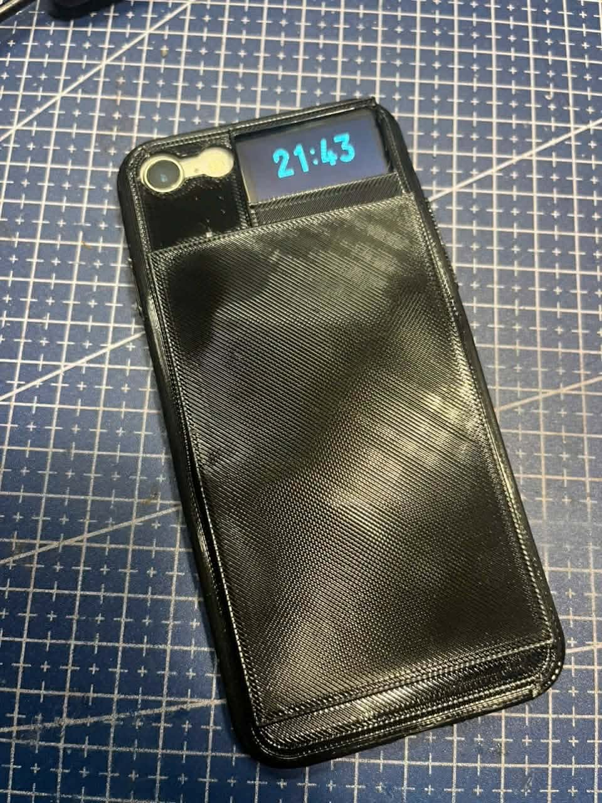

## Overview

OverByte is an open-source, cyberpunk-style smart phone case featuring a secondary OLED display on the back of the phone. The system is designed to provide a minimalist, low-power interface for status indicators, watch faces, notification text, and interactive elements.

The project consists of a custom ESP32-C3 hardware assembly embedded within a 3D-printed case, paired with a native iOS companion app built in Swift/SwiftUI. Together, they communicate via Bluetooth Low Energy (BLE) and Wi-Fi to display real-time clocks, run custom text marquee notifications, show haptic emotes, and support local OTA firmware updates.

## Key Features

* **Procedural Watch Faces:** Real-time rendering of analog and digital clock interfaces directly on the microcontroller.
* **Interactive Haptics & Emotes:** Utilizes a capacitive touch sensor to trigger state-based pixel-art expressions.
* **Custom Marquee Running Text:** Displays smooth, horizontally scrolling text notifications received from the companion app.
* **Native iOS Dashboard:** A custom-built SwiftUI companion app for mode management, custom marquee text transmission, time synchronization, and battery monitoring.
* **OTA Firmware Updates:** Supports wireless firmware flashing over local Wi-Fi.

---

## Gallery

### Physical Device
| Front View | Tilted View | Side View |
| :---: | :---: | :---: |
| 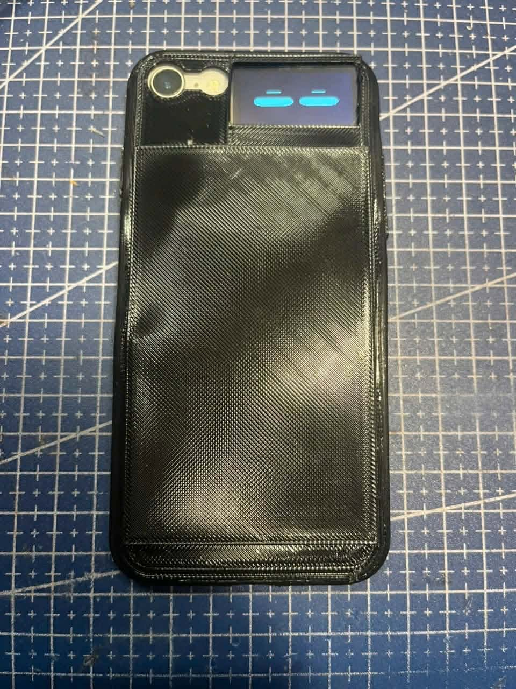 | 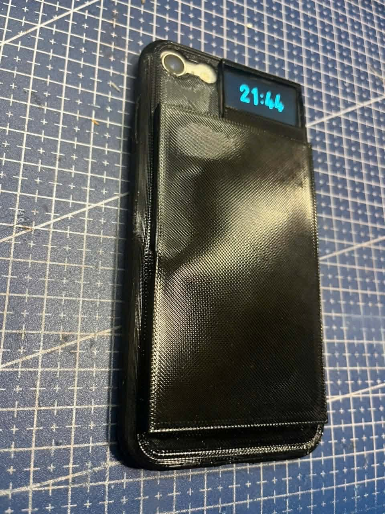 | 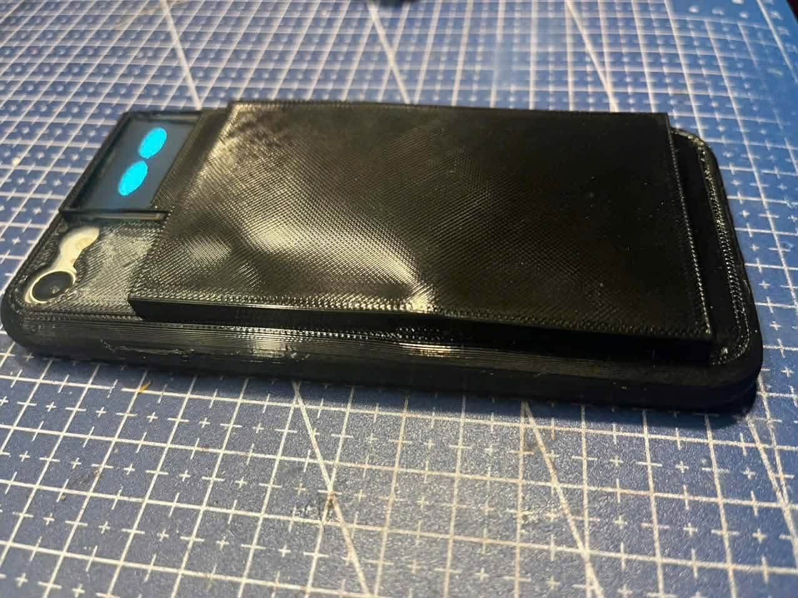 |

### iOS Application UI
| Home Screen | Home (Alternative) | Mochi Emote Selector | Mochi (Alternative) |
| :---: | :---: | :---: | :---: |
| 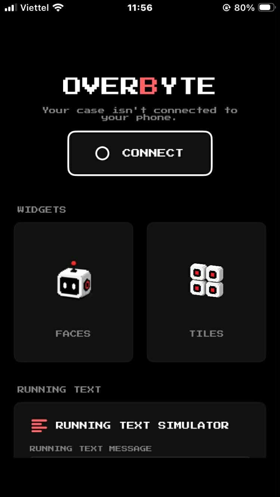 | 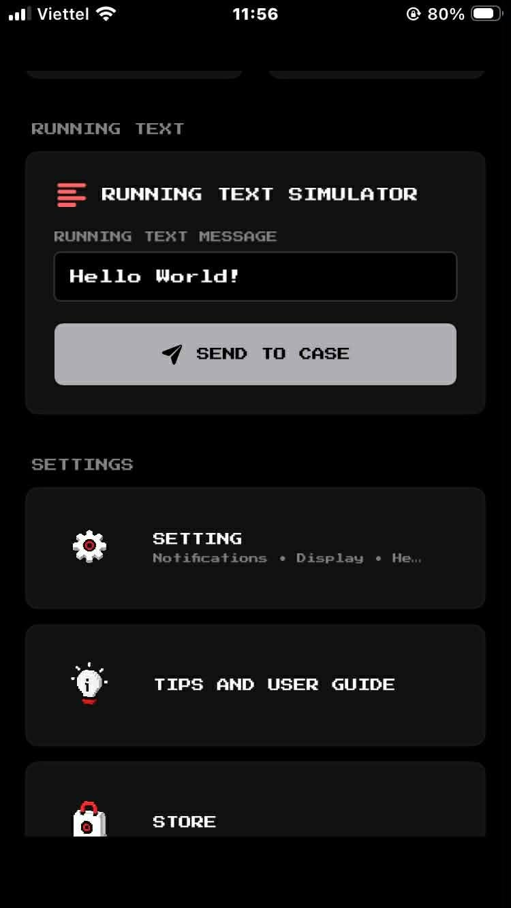 | 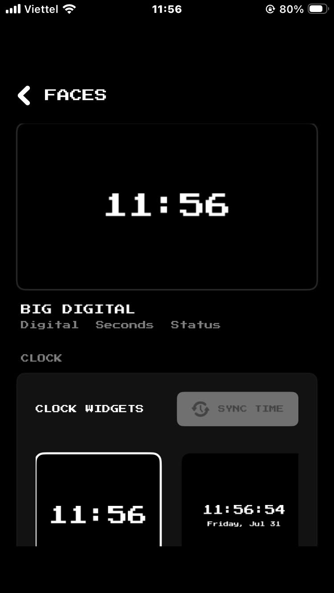 | 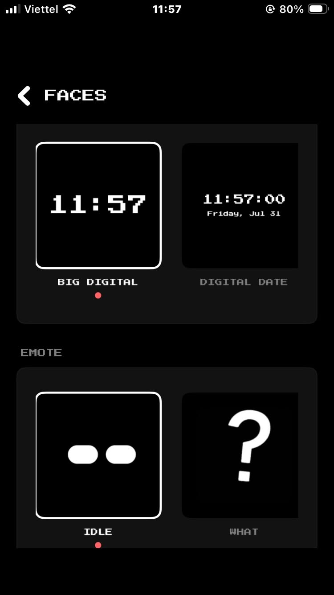 |

### Hardware & PCB Design
| Schematic | PCB Layout | 3D PCB Render |
| :---: | :---: | :---: |
| 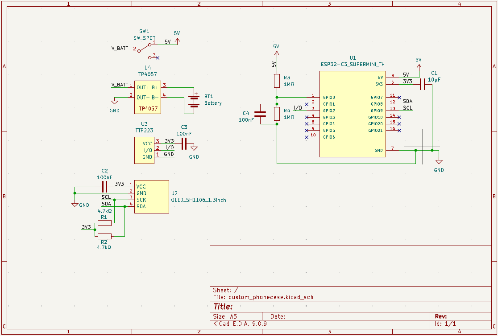 | 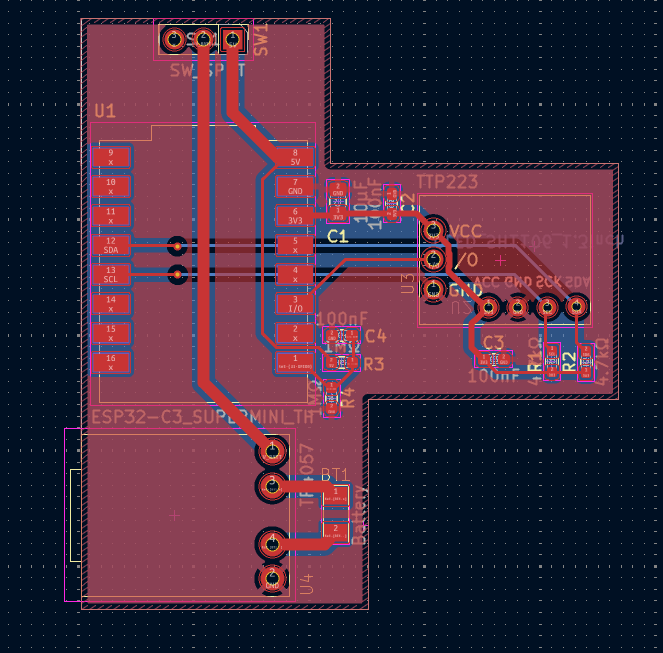 | 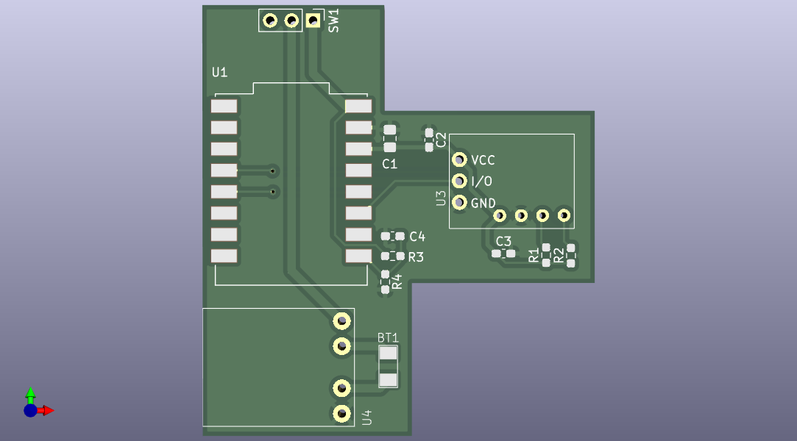 |

### 3D Enclosure Concept
| Front Concept | Tilt Concept | Back Concept |
| :---: | :---: | :---: |
| 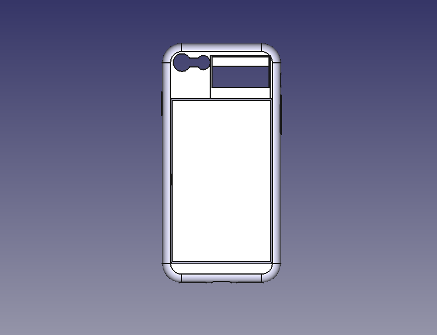 | 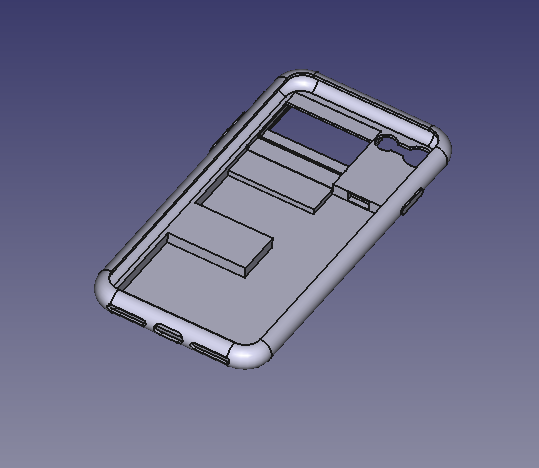 | 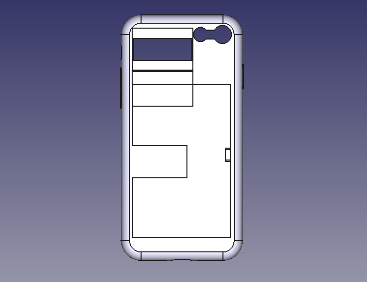 |

---

## Hardware Architecture

The hardware footprint is highly optimized for thickness and power efficiency, designed to integrate directly into a custom 3D-printed phone case.

* **Microcontroller:** ESP32 (Manages BLE stack, display rendering, and touch interrupts)
* **Display:** 128x64 Monochromatic OLED (SH1106/SSD1306) via I2C
* **Sensor:** TTP223 Capacitive Touch Module
* **Power System:** Li-Po battery with integrated custom charging circuitry

### Hardware Repository
All PCB designs, schematics, and mechanical files are open-source and available for review:
* [Schematic Documentation (Image)](assets/schematic.png)
* [Gerber Manufacturing Files](hardware/gerber/)
* [3D Enclosure Models (STL/STEP)](hardware/3d_models/)

---

## Software Stack

The project relies on a strictly partitioned architecture between the embedded system and the mobile client:

1. **Embedded Firmware (C++ / ESP32):** 
   * Developed within the PlatformIO environment.
   * Leverages the `U8g2` library for highly optimized, low-level procedural graphics rendering.
   * Utilizes `NimBLE-Arduino` for lightweight BLE server and client logic.
2. **iOS Client (Swift / SwiftUI):**
   * Built with a modern TabBar architecture adhering to a strict monochromatic design language.
   * Utilizes `XcodeGen` for dynamic `.xcodeproj` generation, ensuring clean version control and CI/CD compatibility.
   * Implements native custom `GifImageView` components for pixel-perfect 1-bit display previews.

---

## Getting Started

### Flashing the Firmware
1. Install [PlatformIO](https://platformio.org/).
2. Navigate to the project root directory.
3. Connect the OverByte hardware via USB.
4. Execute the build and upload command: `pio run -t upload`.

### Building the iOS Application
To avoid merge conflicts with Xcode project files, this repository uses `XcodeGen`.
1. Install XcodeGen: `brew install xcodegen`.
2. Navigate to the `ios` directory.
3. Generate the project: `xcodegen generate`.
4. Open the generated `OverByte.xcodeproj` and build the application to your target iOS device.

---

## License

This project is licensed under the MIT License. See the `LICENSE` file for full details.
